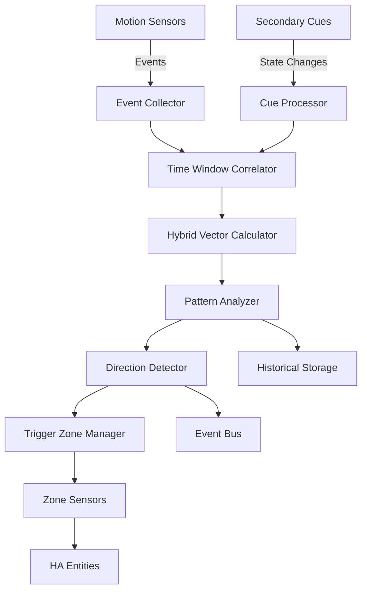

# HA-MotionDirection Specification
## Home Assistant Motion Direction Detection Integration

**Version:** 1.3.0  
**Date:** 2026-01-02  
**Author:** tamaygz  
**Project Type:** HACS Custom Integration  
**License:** MIT  

## 1. Executive Summary

### 1.1 Purpose
HA-MotionDirection is a Home Assistant custom integration that intelligently detects the direction of motion through a space by analyzing the sequential triggering patterns of multiple motion sensors. The integration provides an intuitive visual setup interface where users can place sensors on a 2D floorplan canvas, automatically calculating motion vectors and patterns.

### 1.2 Core Features
- Visual 2D floorplan-based sensor placement
- Automatic motion direction detection
- **Directional triggering zones with configurable entry/exit directions**
- **Secondary cues system for enhanced single-sensor direction detection**
- Configurable time windows for motion correlation
- Motion path prediction
- Zone-based motion tracking
- Real-time motion visualization
- Historical motion pattern analysis
- Pattern learning and behavioral analysis

## 2. Architecture Overview

### 2.1 Component Structure
```
ha-motiondirection/
├── custom_components/
│   └── motiondirection/
│       ├── __init__.py              # Integration setup
│       ├── manifest.json            # Integration metadata
│       ├── config_flow.py           # Configuration flow
│       ├── const.py                 # Constants
│       ├── coordinator.py           # Data coordinator
│       ├── sensor.py                # Sensor platform
│       ├── binary_sensor.py         # Binary sensor platform
│       ├── services.yaml            # Service definitions
│       ├── strings.json             # Localization
│       ├── translations/            # Translation files
│       ├── core/                    # Core logic
│       │   ├── motion_detector.py   # Motion detection engine
│       │   ├── pattern_analyzer.py  # Pattern analysis
│       │   ├── vector_calculator.py # Vector calculations
│       │   ├── zone_manager.py      # Zone management
│       │   ├── trigger_zone.py      # Trigger zone logic
│       │   └── secondary_cue.py     # Secondary cue processor
│       ├── models/                  # Data models
│       │   ├── sensor_node.py       # Sensor node model
│       │   ├── motion_event.py      # Motion event model
│       │   ├── motion_path.py       # Motion path model
│       │   ├── floorplan.py         # Floorplan model
│       │   ├── trigger_zone_model.py # Trigger zone model
│       │   └── secondary_cue_model.py # Secondary cue model
│       └── frontend/                # Frontend components
│           ├── floorplan-editor.js  # Floorplan editor
│           ├── zone-editor.js       # Zone editor component
│           ├── cue-editor.js        # Secondary cue editor
│           └── motion-visualizer.js # Motion visualization
├── tests/                           # Test suite
├── README.md
├── hacs.json                        # HACS configuration
└── requirements.txt
```

### 2.2 Data Flow Architecture


### 2.3 Integration Points
- **Home Assistant Core**: Entity registry, state machine, event bus
- **Frontend**: Lovelace custom cards, configuration UI
- **Data Storage**: Recorder integration for historical data
- **Notification System**: Integration with HA notification services
- **Automation Engine**: Service calls and event triggers

## 3. Core Components

### 3.1 Motion Detection Engine

#### 3.1.1 Event Collection
- **Real-time sensor monitoring**: Subscribe to all configured motion sensor state changes
- **Event timestamping**: Microsecond precision timestamps
- **Event buffering**: Configurable buffer size (default: 100 events)
- **Event filtering**: Debounce and noise reduction

#### 3.1.2 Time Window Correlation
```python
class TimeWindowCorrelator:
    """
    Correlates motion events within configurable time windows
    """
    
    DEFAULT_WINDOW_SIZE = 5000  # milliseconds
    MIN_WINDOW_SIZE = 500
    MAX_WINDOW_SIZE = 30000
    
    def correlate_events(self, events: List[MotionEvent], 
                        window_size: int = DEFAULT_WINDOW_SIZE) -> List[MotionSequence]:
        """
        Groups related motion events based on temporal proximity
        
        Args:
            events: List of motion events to correlate
            window_size: Time window in milliseconds
            
        Returns:
            List of motion sequences where events are temporally related
        """
        sequences = []
        current_sequence = []
        
        for event in sorted(events, key=lambda e: e.timestamp):
            if not current_sequence:
                current_sequence.append(event)
            else:
                time_diff = (event.timestamp - current_sequence[-1].timestamp).total_seconds() * 1000
                if time_diff <= window_size:
                    current_sequence.append(event)
                else:
                    sequences.append(MotionSequence(current_sequence))
                    current_sequence = [event]
        
        if current_sequence:
            sequences.append(MotionSequence(current_sequence))
            
        return sequences
```

#### 3.1.3 Vector Calculation
```python
class VectorCalculator:
    """
    Calculates motion vectors between sensor triggers
    """
    
    def calculate_direction_vector(self, sensor1: SensorNode, sensor2: SensorNode) -> Tuple[float, float]:
        """
        Calculate normalized direction vector from sensor1 to sensor2
        """
        dx = sensor2.position[0] - sensor1.position[0]
        dy = sensor2.position[1] - sensor1.position[1]
        magnitude = math.sqrt(dx**2 + dy**2)
        
        if magnitude == 0:
            return (0, 0)
            
        return (dx / magnitude, dy / magnitude)
    
    def calculate_weighted_vector(self, vectors: List[Tuple[float, float, float]]) -> Tuple[float, float]:
        """
        Calculate weighted average of multiple direction vectors
        
        Args:
            vectors: List of (x, y, weight) tuples
            
        Returns:
            Normalized weighted direction vector
        """
        total_weight = sum(v[2] for v in vectors)
        if total_weight == 0:
            return (0, 0)
            
        weighted_x = sum(v[0] * v[2] for v in vectors) / total_weight
        weighted_y = sum(v[1] * v[2] for v in vectors) / total_weight
        
        magnitude = math.sqrt(weighted_x**2 + weighted_y**2)
        if magnitude == 0:
            return (0, 0)
            
        return (weighted_x / magnitude, weighted_y / magnitude)
    
    def calculate_confidence(self, sequence: MotionSequence) -> float:
        """
        Calculate confidence score for direction detection
        
        Factors:
        - Number of sensors involved (more is better)
        - Temporal consistency (regular intervals)
        - Spatial consistency (linear path)
        - Sensor reliability scores
        """
        if len(sequence.events) < 2:
            return 0.0
            
        # Base confidence from sensor count
        sensor_confidence = min(len(sequence.events) / 5.0, 1.0)
        
        # Temporal consistency
        time_diffs = []
        for i in range(1, len(sequence.events)):
            diff = (sequence.events[i].timestamp - sequence.events[i-1].timestamp).total_seconds()
            time_diffs.append(diff)
        
        if time_diffs:
            avg_diff = sum(time_diffs) / len(time_diffs)
            variance = sum((d - avg_diff)**2 for d in time_diffs) / len(time_diffs)
            temporal_confidence = 1.0 / (1.0 + variance)
        else:
            temporal_confidence = 0.5
            
        # Combine factors
        confidence = (sensor_confidence * 0.6 + temporal_confidence * 0.4)
        
        return min(confidence, 1.0)
```

### 3.2 Floorplan Management

#### 3.2.1 Canvas Configuration
```yaml
floorplan:
  dimensions: 
    width: 1000  # pixels or meters
    height: 800
    scale: 10    # pixels per meter
  background: 
    image: "local/floorplan.png"
    opacity: 0.5
  grid:
    enabled: true
    size: 20
    snap: true
  layers:
    - id: "background"
      z_index: 0
    - id: "sensors"
      z_index: 1
    - id: "secondary_cues"
      z_index: 2
    - id: "trigger_zones"
      z_index: 3
    - id: "motion_paths"
      z_index: 4
```

#### 3.2.2 Sensor Placement
- Drag-and-drop interface
- Automatic entity discovery from Home Assistant
- Sensor range visualization (circular overlay)
- Overlap detection and warnings
- Snap-to-grid functionality
- Import/export floorplan configurations

### 3.3 Trigger Zones

#### 3.3.1 Zone Definition Model
```python
from dataclasses import dataclass, field
from typing import List, Tuple, Optional
from datetime import datetime

@dataclass
class TriggerZone:
    """Represents a triggerable zone on the floorplan"""
    
    id: str
    name: str
    polygon: List[Tuple[float, float]]  # Zone boundary points
    center: Tuple[float, float]         # Calculated center point
    
    # Directional configuration
    known_directions: List['DirectionConfig']
    
    # Detection settings
    min_dwell_time: int = 500  # ms - minimum time in zone to trigger
    max_transit_time: int = 10000  # ms - maximum time for transit
    sensitivity: float = 0.7  # 0-1 confidence threshold
    
    # State
    current_state: str = "idle"  # idle, occupied, transit
    last_direction: Optional[str] = None
    last_trigger_time: Optional[datetime] = None
    
    def calculate_center(self) -> Tuple[float, float]:
        """Calculate geometric center of polygon"""
        if not self.polygon:
            return (0, 0)
        x_coords = [p[0] for p in self.polygon]
        y_coords = [p[1] for p in self.polygon]
        return (sum(x_coords) / len(x_coords), sum(y_coords) / len(y_coords))
    
    def contains_point(self, point: Tuple[float, float]) -> bool:
        """Check if point is inside zone polygon using ray casting"""
        x, y = point
        n = len(self.polygon)
        inside = False
        
        p1x, p1y = self.polygon[0]
        for i in range(1, n + 1):
            p2x, p2y = self.polygon[i % n]
            if y > min(p1y, p2y):
                if y <= max(p1y, p2y):
                    if x <= max(p1x, p2x):
                        if p1y != p2y:
                            xinters = (y - p1y) * (p2x - p1x) / (p2y - p1y) + p1x
                        if p1x == p2x or x <= xinters:
                            inside = not inside
            p1x, p1y = p2x, p2y
        
        return inside

@dataclass
class DirectionConfig:
    """Configuration for a specific direction through a zone"""
    
    name: str  # e.g., "east", "west", "entrance", "exit"
    vector: Tuple[float, float]  # Normalized direction vector
    entry_edge: Optional[str] = None  # Which edge typically used for entry
    exit_edge: Optional[str] = None   # Which edge typically used for exit
    aliases: List[str] = field(default_factory=list)  # Alternative names
    
    def matches_vector(self, test_vector: Tuple[float, float], tolerance: float = 30.0) -> bool:
        """Check if test vector matches this direction within tolerance (degrees)"""
        import math
        
        # Calculate angle between vectors
        dot_product = self.vector[0] * test_vector[0] + self.vector[1] * test_vector[1]
        angle = math.acos(max(-1.0, min(1.0, dot_product)))
        angle_degrees = math.degrees(angle)
        
        return angle_degrees <= tolerance
```

#### 3.3.2 Zone Direction Detection
```python
class TriggerZoneManager:
    """Manages trigger zones and their directional detection"""
    
    def __init__(self, zones: List[TriggerZone]):
        self.zones = {zone.id: zone for zone in zones}
        self.active_transits = {}
    
    def detect_zone_transition(self, 
                              motion_path: 'MotionPath',
                              zone: TriggerZone) -> Optional['ZoneTransition']:
        """
        Detects if motion path crosses zone and determines direction
        
        Args:
            motion_path: Path of motion events
            zone: Zone to check for transition
            
        Returns:
            ZoneTransition if detected, None otherwise
        """
        entry_point = self._find_entry_point(motion_path, zone)
        exit_point = self._find_exit_point(motion_path, zone)
        
        if entry_point and exit_point:
            # Calculate direction vector through zone
            direction_vector = (
                exit_point[0] - entry_point[0],
                exit_point[1] - entry_point[1]
            )
            
            # Normalize
            magnitude = math.sqrt(direction_vector[0]**2 + direction_vector[1]**2)
            if magnitude > 0:
                normalized_vector = (
                    direction_vector[0] / magnitude,
                    direction_vector[1] / magnitude
                )
                
                # Match to known directions
                best_match = self._match_direction(zone, normalized_vector)
                
                if best_match:
                    dwell_time = self._calculate_dwell_time(motion_path, zone)
                    
                    return ZoneTransition(
                        zone_id=zone.id,
                        direction=best_match.name,
                        entry_point=entry_point,
                        exit_point=exit_point,
                        dwell_time=dwell_time,
                        confidence=self._calculate_zone_confidence(motion_path, zone, best_match)
                    )
        
        return None
    
    def _find_entry_point(self, path: 'MotionPath', zone: TriggerZone) -> Optional[Tuple[float, float]]:
        """Find where path enters zone"""
        for i, point in enumerate(path.points):
            if zone.contains_point(point.position):
                return point.position
        return None
    
    def _find_exit_point(self, path: 'MotionPath', zone: TriggerZone) -> Optional[Tuple[float, float]]:
        """Find where path exits zone"""
        for i in range(len(path.points) - 1, -1, -1):
            point = path.points[i]
            if zone.contains_point(point.position):
                return point.position
        return None
    
    def _match_direction(self, zone: TriggerZone, vector: Tuple[float, float]) -> Optional[DirectionConfig]:
        """Match vector to zone's known directions"""
        best_match = None
        best_score = 0
        
        for direction in zone.known_directions:
            if direction.matches_vector(vector):
                # Calculate match score based on angle difference
                dot_product = direction.vector[0] * vector[0] + direction.vector[1] * vector[1]
                score = (dot_product + 1) / 2  # Normalize to 0-1
                
                if score > best_score:
                    best_score = score
                    best_match = direction
        
        return best_match if best_score > 0.5 else None
    
    def _calculate_dwell_time(self, path: 'MotionPath', zone: TriggerZone) -> int:
        """Calculate time spent in zone in milliseconds"""
        points_in_zone = [p for p in path.points if zone.contains_point(p.position)]
        if len(points_in_zone) < 2:
            return 0
        
        time_diff = (points_in_zone[-1].timestamp - points_in_zone[0].timestamp).total_seconds()
        return int(time_diff * 1000)
    
    def _calculate_zone_confidence(self, path: 'MotionPath', 
                                   zone: TriggerZone, 
                                   direction: DirectionConfig) -> float:
        """Calculate confidence of zone direction detection"""
        # Factor 1: Path consistency
        points_in_zone = [p for p in path.points if zone.contains_point(p.position)]
        path_confidence = min(len(points_in_zone) / 3.0, 1.0)
        
        # Factor 2: Direction match quality
        # Factor 3: Zone sensitivity setting
        
        return path_confidence * 0.6 + 0.4 * zone.sensitivity
```

### 3.4 Secondary Cues System

#### 3.4.1 Secondary Cue Model
```python
@dataclass
class SecondaryCue:
    """Represents a secondary cue device on the floorplan"""
    
    id: str
    name: str
    entity_id: str  # HA entity to monitor
    position: Tuple[float, float]  # Position on floorplan
    cue_type: str  # door, light, switch, presence, temperature, etc.
    
    # Directional inference configuration
    directional_hints: List['DirectionalHint']
    
    # Timing configuration
    correlation_window: int = 3000  # ms - max time before/after motion
    pre_trigger_window: int = 2000  # ms - cue before motion
    post_trigger_window: int = 2000  # ms - cue after motion
    
    # Confidence weights
    confidence_weight: float = 0.6  # Lower than motion sensors
    reliability: float = 0.8  # Device reliability factor
    
    # State configuration
    trigger_states: List[str] = None  # States that trigger cue
    ignore_states: List[str] = None  # States to ignore
    
    # Visual configuration
    icon: str = "mdi:lightbulb"
    color: str = "#FFA500"
    range_radius: float = 0  # No range for most cues

@dataclass
class DirectionalHint:
    """Defines how a cue state change implies direction"""
    
    state_change: 'StateChange'  # e.g., off->on, closed->open
    implied_direction: str  # Direction name or vector
    confidence: float = 0.7  # Confidence of this implication
    condition: Optional[str] = None  # Template condition
    
@dataclass
class StateChange:
    """Represents a state transition"""
    from_state: Optional[str]  # None means any state
    to_state: str
    attribute: Optional[str] = None  # Track attribute changes
```

#### 3.4.2 Cue Types and Behaviors
```python
class CueTypeRegistry:
    """Registry of secondary cue types and their behaviors"""
    
    CUE_TYPES = {
        "door": {
            "domains": ["binary_sensor", "cover"],
            "default_states": ["open", "opening", "on"],
            "confidence": 0.85,
            "typical_correlation": 1000,  # ms
            "bidirectional": True,
            "default_hints": [
                {"state": "open", "implies": "entering"},
                {"state": "closed", "implies": "exiting"}
            ]
        },
        "light": {
            "domains": ["light", "switch"],
            "default_states": ["on"],
            "confidence": 0.65,
            "typical_correlation": 2000,
            "bidirectional": False,
            "default_hints": [
                {"state": "on", "implies": "entering"}
            ]
        },
        "switch": {
            "domains": ["switch", "input_boolean"],
            "default_states": ["on"],
            "confidence": 0.60,
            "typical_correlation": 1500,
            "bidirectional": True,
            "default_hints": []  # User-defined
        },
        "presence": {
            "domains": ["device_tracker", "person", "binary_sensor"],
            "default_states": ["home", "on"],
            "confidence": 0.90,
            "typical_correlation": 5000,
            "bidirectional": True,
            "default_hints": [
                {"state": "home", "implies": "arriving"},
                {"state": "away", "implies": "leaving"}
            ]
        },
        "temperature": {
            "domains": ["sensor", "climate"],
            "default_states": ["rising", "falling"],
            "confidence": 0.40,
            "typical_correlation": 30000,
            "bidirectional": False,
            "default_hints": []
        },
        "vibration": {
            "domains": ["binary_sensor"],
            "default_states": ["on", "detected"],
            "confidence": 0.70,
            "typical_correlation": 500,
            "bidirectional": False,
            "default_hints": []
        },
        "power": {
            "domains": ["sensor", "switch"],
            "default_states": ["rising"],
            "confidence": 0.55,
            "typical_correlation": 3000,
            "bidirectional": False,
            "default_hints": []
        },
        "media": {
            "domains": ["media_player"],
            "default_states": ["playing", "on"],
            "confidence": 0.50,
            "typical_correlation": 5000,
            "bidirectional": False,
            "default_hints": [
                {"state": "playing", "implies": "present"}
            ]
        }
    }
    
    @classmethod
    def get_cue_config(cls, cue_type: str) -> dict:
        """Get configuration for a cue type"""
        return cls.CUE_TYPES.get(cue_type, {})
    
    @classmethod
    def is_valid_cue_type(cls, cue_type: str) -> bool:
        """Check if cue type is supported"""
        return cue_type in cls.CUE_TYPES
```

#### 3.4.3 Hybrid Motion Detection
```python
from collections import deque
import math

class HybridMotionDetector:
    """Combines motion sensors and secondary cues for direction detection"""
    
    def __init__(self):
        self.motion_buffer = deque(maxlen=100)
        self.cue_buffer = deque(maxlen=200)
        self.correlation_engine = CorrelationEngine()
    
    async def process_motion_event(self, event: 'MotionEvent'):
        """Process a motion sensor event"""
        self.motion_buffer.append(event)
        
        # Check for correlated cues
        correlated_cues = self._find_correlated_cues(
            event,
            time_window=5000
        )
        
        # Determine detection method
        if len(self.motion_buffer) >= 2:
            # Multi-sensor detection (traditional)
            direction = self._calculate_multi_sensor_direction(
                list(self.motion_buffer)[-2:]
            )
            detection_method = "multi_sensor"
        elif correlated_cues:
            # Hybrid detection with single motion + cues
            direction = self._calculate_hybrid_direction(event, correlated_cues)
            detection_method = "hybrid"
        else:
            # Insufficient data
            direction = None
            detection_method = "insufficient_data"
        
        return direction, detection_method, correlated_cues
    
    def _calculate_hybrid_direction(self,
                                   motion: 'MotionEvent',
                                   cues: List['CueEvent']) -> 'DirectionResult':
        """Calculate direction using motion + secondary cues"""
        
        direction_votes = {}
        total_confidence = 0
        
        # Collect direction votes from cues
        for cue in cues:
            for hint in cue.cue.directional_hints:
                if self._matches_state_change(cue, hint.state_change):
                    direction = hint.implied_direction
                    confidence = hint.confidence * cue.cue.confidence_weight * cue.cue.reliability
                    
                    if direction not in direction_votes:
                        direction_votes[direction] = 0
                    direction_votes[direction] += confidence
                    total_confidence += confidence
        
        # Find winner
        if direction_votes:
            best_direction = max(direction_votes.items(), key=lambda x: x[1])
            final_confidence = best_direction[1] / total_confidence if total_confidence > 0 else 0
            
            return DirectionResult(
                direction=best_direction[0],
                confidence=final_confidence,
                method="cue_assisted",
                contributing_cues=[c.cue.id for c in cues]
            )
        
        return None
    
    def _find_correlated_cues(self, 
                             motion: 'MotionEvent',
                             time_window: int) -> List['CueEvent']:
        """Find cues that correlate with motion event"""
        
        correlated = []
        motion_time = motion.timestamp
        
        for cue_event in self.cue_buffer:
            # Check temporal correlation
            time_diff = abs((cue_event.timestamp - motion_time).total_seconds() * 1000)
            
            if time_diff <= time_window:
                # Check spatial correlation
                if self._is_spatially_correlated(motion, cue_event):
                    correlated.append(cue_event)
        
        return correlated
    
    def _is_spatially_correlated(self,
                                motion: 'MotionEvent',
                                cue: 'CueEvent') -> bool:
        """Check if cue is near enough to motion to be relevant"""
        
        distance = self._calculate_distance(
            motion.sensor.position,
            cue.cue.position
        )
        
        # Dynamic threshold based on cue type
        threshold = self._get_correlation_distance(cue.cue.cue_type)
        
        return distance <= threshold
    
    def _calculate_distance(self, pos1: Tuple[float, float], 
                           pos2: Tuple[float, float]) -> float:
        """Calculate Euclidean distance between two positions"""
        return math.sqrt((pos2[0] - pos1[0])**2 + (pos2[1] - pos1[1])**2)
    
    def _get_correlation_distance(self, cue_type: str) -> float:
        """Get maximum correlation distance for cue type"""
        distances = {
            "door": 50,  # pixels/units
            "light": 100,
            "switch": 80,
            "presence": 200,
            "temperature": 150,
            "vibration": 30,
            "power": 100,
            "media": 150
        }
        return distances.get(cue_type, 100)
    
    def _matches_state_change(self, cue_event: 'CueEvent', 
                             expected: 'StateChange') -> bool:
        """Check if cue event matches expected state change"""
        if expected.from_state and cue_event.old_state != expected.from_state:
            return False
        if cue_event.new_state != expected.to_state:
            return False
        return True
```

### 3.5 Pattern Analysis

#### 3.5.1 Pattern Types
1. **Linear Motion**: Simple A→B movement
2. **Circular Motion**: Patrol or wandering patterns
3. **Zone Transitions**: Movement between defined areas
4. **Dwell Patterns**: Stationary presence detection
5. **Anomaly Detection**: Unusual movement patterns
6. **Zone-Based Patterns**: Common zone traversal sequences

#### 3.5.2 Pattern Analyzer
```python
class PatternAnalyzer:
    """Analyzes motion patterns and learns common behaviors"""
    
    def __init__(self):
        self.pattern_history = deque(maxlen=1000)
        self.learned_patterns = {}
    
    def analyze_sequence(self, motion_sequence: 'MotionSequence') -> str:
        """Determine pattern type from motion sequence"""
        
        if len(motion_sequence.events) < 2:
            return "insufficient_data"
        
        # Check for linear pattern
        if self._is_linear(motion_sequence):
            return "linear"
        
        # Check for circular pattern
        if self._is_circular(motion_sequence):
            return "circular"
        
        # Check for zone transition
        if self._is_zone_transition(motion_sequence):
            return "zone_transition"
        
        # Check for stationary
        if self._is_stationary(motion_sequence):
            return "stationary"
        
        return "random"
    
    def _is_linear(self, sequence: 'MotionSequence') -> bool:
        """Check if motion follows a linear path"""
        if len(sequence.events) < 3:
            return True  # Assume linear for short sequences
        
        # Calculate vectors between consecutive sensors
        vectors = []
        for i in range(len(sequence.events) - 1):
            v = self._calculate_vector(
                sequence.events[i].sensor.position,
                sequence.events[i+1].sensor.position
            )
            vectors.append(v)
        
        # Check if all vectors point in similar direction
        if not vectors:
            return False
        
        reference = vectors[0]
        for v in vectors[1:]:
            dot_product = reference[0] * v[0] + reference[1] * v[1]
            if dot_product < 0.7:  # Less than ~45 degree difference
                return False
        
        return True
    
    def _is_circular(self, sequence: 'MotionSequence') -> bool:
        """Check if motion follows a circular/loop pattern"""
        if len(sequence.events) < 4:
            return False
        
        # Check if path returns to starting position
        start_pos = sequence.events[0].sensor.position
        end_pos = sequence.events[-1].sensor.position
        
        distance = math.sqrt(
            (end_pos[0] - start_pos[0])**2 + 
            (end_pos[1] - start_pos[1])**2
        )
        
        # If end is close to start, likely circular
        return distance < 50  # Within 50 units
    
    def _is_zone_transition(self, sequence: 'MotionSequence') -> bool:
        """Check if motion represents zone-to-zone transition"""
        # Check if events span multiple zones
        zones = set()
        for event in sequence.events:
            if hasattr(event.sensor, 'zone'):
                zones.add(event.sensor.zone)
        
        return len(zones) >= 2
    
    def _is_stationary(self, sequence: 'MotionSequence') -> bool:
        """Check if motion is stationary (repeated triggers in same area)"""
        if len(sequence.events) < 3:
            return False
        
        # Check if all events from same or very close sensors
        positions = [e.sensor.position for e in sequence.events]
        max_distance = 0
        
        for i in range(len(positions)):
            for j in range(i + 1, len(positions)):
                dist = math.sqrt(
                    (positions[j][0] - positions[i][0])**2 +
                    (positions[j][1] - positions[i][1])**2
                )
                max_distance = max(max_distance, dist)
        
        return max_distance < 30  # Within 30 units
    
    def learn_patterns(self, historical_data: List['MotionSequence'], 
                      min_occurrences: int = 5) -> List['LearnedPattern']:
        """Learn common patterns from historical data"""
        
        pattern_counts = {}
        
        for sequence in historical_data:
            # Create pattern signature
            signature = self._create_signature(sequence)
            
            if signature not in pattern_counts:
                pattern_counts[signature] = {
                    'count': 0,
                    'example': sequence,
                    'confidence_sum': 0
                }
            
            pattern_counts[signature]['count'] += 1
            pattern_counts[signature]['confidence_sum'] += sequence.confidence
        
        # Filter patterns by minimum occurrences
        learned = []
        for signature, data in pattern_counts.items():
            if data['count'] >= min_occurrences:
                avg_confidence = data['confidence_sum'] / data['count']
                learned.append(LearnedPattern(
                    signature=signature,
                    occurrences=data['count'],
                    confidence=avg_confidence,
                    example=data['example']
                ))
        
        return learned
    
    def _create_signature(self, sequence: 'MotionSequence') -> str:
        """Create a unique signature for a motion pattern"""
        # Use sensor IDs and approximate timing
        sensors = [e.sensor.id for e in sequence.events]
        return "->".join(sensors)
    
    def _calculate_vector(self, pos1: Tuple[float, float], 
                         pos2: Tuple[float, float]) -> Tuple[float, float]:
        """Calculate normalized vector between positions"""
        dx = pos2[0] - pos1[0]
        dy = pos2[1] - pos1[1]
        magnitude = math.sqrt(dx**2 + dy**2)
        
        if magnitude == 0:
            return (0, 0)
        
        return (dx / magnitude, dy / magnitude)
```

## 4. Configuration Schema

### 4.1 Integration Configuration
```yaml
motiondirection:
  # Global settings
  global:
    time_window: 5000  # ms
    min_sensors_for_direction: 2
    use_secondary_cues: true  # Enable secondary cues
    confidence_threshold: 0.7
    history_retention_days: 30
  
  # Floorplans
  floorplans: 
    - id: "ground_floor"
      name: "Ground Floor"
      dimensions: 
        width: 1000
        height: 800
        scale: 10  # pixels per meter
      background:
        image: "local/floorplan.png"
        opacity: 0.5
      
      # Motion Sensors
      sensors:
        - entity_id: "binary_sensor.motion_hallway"
          position: {x: 100, y: 400}
          range: 50
          weight: 1.0
          type: "pir"
        - entity_id: "binary_sensor.motion_kitchen"
          position: {x: 300, y: 400}
          range: 60
          weight: 0.8
          type: "pir"
      
      # Secondary Cues
      secondary_cues:
        - entity_id: "binary_sensor.front_door"
          position: {x: 50, y: 400}
          cue_type: "door"
          directional_hints:
            - state_change: {from_state: "off", to_state: "on"}
              implied_direction: "entering"
              confidence: 0.85
            - state_change: {from_state: "on", to_state: "off"}
              implied_direction: "exiting"
              confidence: 0.80
        - entity_id: "light.hallway"
          position: {x: 100, y: 400}
          cue_type: "light"
          directional_hints:
            - state_change: {to_state: "on"}
              implied_direction: "entering"
              confidence: 0.65
      
      # Trigger Zones
      zones:
        - id: "entrance"
          name: "Entrance Area"
          polygon: [[0,0], [200,0], [200,200], [0,200]]
          known_directions:
            - name: "entering"
              vector: [1, 0]
              aliases: ["east", "inside"]
            - name: "exiting"
              vector: [-1, 0]
              aliases: ["west", "outside"]
          min_dwell_time: 500
          sensitivity: 0.8
        
        - id: "east_hallway"
          name: "East Hallway"
          polygon: [[200,350], [400,350], [400,450], [200,450]]
          known_directions:
            - name: "east"
              vector: [1, 0]
            - name: "west"
              vector: [-1, 0]
          min_dwell_time: 300
          sensitivity: 0.7
  
  # Advanced settings
  advanced:
    debounce_time: 100  # ms
    parallel_paths: true
    interpolation: "linear"  # linear, cubic, predictive
    sensitivity: 
      low: 0.3
      medium: 0.5
      high: 0.8
    
    # Zone detection settings
    zone_detection:
      enabled: true
      min_confidence: 0.6
      direction_tolerance: 30  # degrees
    
    # Secondary cue settings
    secondary_cue_settings:
      enabled: true
      default_correlation_window: 3000  # ms
      spatial_correlation_distance: 100  # units
      min_cue_confidence: 0.5
      min_confidence_for_single_motion: 0.5
    
    # Pattern learning
    pattern_learning:
      enabled: true
      min_samples: 10
      learning_window_days: 7

### 4.2 Per-Sensor Configuration
```yaml
sensor_config:
  "binary_sensor.motion_hallway":
    type: "pir"  # pir, radar, camera, hybrid
    detection_angle: 120  # degrees
    detection_range: 5  # meters
    cooldown_period: 2000  # ms
    reliability: 0.95  # 0-1 confidence factor
    zones: ["entrance", "hallway"]
    ignore_between: "23:00-06:00"  # Optional time filter
```

### 4.3 Cue Learning Configuration
```yaml
cue_learning:
  enabled: true
  learning_period: 604800  # 1 week in seconds
  min_samples_for_pattern: 10
  confidence_threshold: 0.7
  patterns_to_learn:
    - type: "sequence"
      description: "Sequential cue-motion patterns"
      window: 5000  # ms
    - type: "correlation"
      description: "Cue-motion correlations"
      window: 10000  # ms
  auto_suggest: true  # Suggest new cue configurations
  auto_apply: false  # Don't apply without confirmation
```

## 5. Entities and Attributes

### 5.1 Primary Entities

#### 5.1.1 Motion Direction Sensor
```yaml
sensor.motion_direction:
  state: "north_east"  # Primary direction
  attributes:
    confidence: 0.89
    detection_method: "hybrid"  # multi_sensor, hybrid, or cue_assisted
    vector: [0.7, 0.7]  # Normalized vector
    speed: 1.2  # m/s estimated
    path: ["hallway", "kitchen", "living_room"]
    triggered_sensors: ["sensor1", "sensor2"]
    contributing_cues: ["front_door", "hallway_light"]
    cue_confidence: 0.75
    active_zones: ["east_hallway", "kitchen_entrance"]
    last_update: "2026-01-02T10:30:45Z"
```

#### 5.1.2 Motion Pattern Sensor
```yaml
sensor.motion_pattern:
  state: "linear"  # linear, circular, stationary, random, zone_transition
  attributes:
    pattern_confidence: 0.75
    pattern_duration: 5000  # ms
    pattern_history: []  # Last 10 patterns
    zone_sequence: ["entrance", "east_hallway", "kitchen"]
```

### 5.2 Binary Sensors
```yaml
binary_sensor.motion_detected:
  state: "on/off"
  attributes:
    active_zones: ["entrance", "hallway"]
    sensor_count: 3
    detection_method: "hybrid"

binary_sensor.motion_anomaly:
  state: "on/off"
  attributes:
    anomaly_score: 0.92
    anomaly_type: "unexpected_path"
    expected_pattern: "entrance->hallway->kitchen"
    actual_pattern: "entrance->bedroom"
```

### 5.3 Zone Sensors

#### 5.3.1 Zone Direction Sensor
```yaml
sensor.zone_east_hallway_direction:
  state: "east"  # Current/last detected direction
  attributes:
    zone_id: "east_hallway"
    zone_name: "East Hallway"
    confidence: 0.92
    vector: [1.0, 0.0]
    entry_time: "2026-01-02T10:30:45Z"
    exit_time: "2026-01-02T10:30:47Z"
    dwell_time: 2000  # ms
    transit_speed: 1.5  # m/s
    triggered_sensors: ["motion_hallway_1", "motion_hallway_2"]
    available_directions: ["east", "west"]
    history:  # Last 5 transitions
      - direction: "east"
        timestamp: "2026-01-02T10:30:45Z"
        confidence: 0.92
      - direction: "west"
        timestamp: "2026-01-02T10:25:30Z"
        confidence: 0.88
```

#### 5.3.2 Zone Occupancy Binary Sensor
```yaml
binary_sensor.zone_east_hallway_occupied:
  state: "on/off"
  attributes:
    zone_id: "east_hallway"
    zone_name: "East Hallway"
    occupancy_start: "2026-01-02T10:30:45Z"
    occupancy_duration: 1500  # ms
    last_direction: "east"
    motion_detected: true
    sensors_in_zone: ["motion_hallway_1"]
```

#### 5.3.3 Zone Transit Binary Sensor
```yaml
binary_sensor.zone_east_hallway_transit:
  state: "on/off"  # On during active transit
  attributes:
    zone_id: "east_hallway"
    direction: "east"
    confidence: 0.89
    entry_point: [105, 400]
    current_position: [150, 400]  # Estimated
    predicted_exit: [195, 400]
    progress: 0.45  # 0-1 through zone
```

### 5.4 Zone Statistics Sensors
```yaml
sensor.zone_east_hallway_statistics:
  state: "15"  # Total transitions today
  attributes:
    zone_id: "east_hallway"
    transitions_today: 15
    transitions_hour: 3
    common_direction: "east"
    direction_breakdown:
      east: 10
      west: 5
    average_dwell_time: 1800  # ms
    average_transit_time: 2100  # ms
    peak_hour: "08:00"
    last_reset: "2026-01-02T00:00:00Z"
```

### 5.5 Secondary Cue Sensors

#### 5.5.1 Secondary Cue Status Sensor
```yaml
sensor.secondary_cue_front_door:
  state: "active"  # active, idle, or triggered
  attributes:
    cue_id: "front_door"
    cue_type: "door"
    entity_id: "binary_sensor.front_door"
    last_trigger: "2026-01-02T10:30:43Z"
    last_state_change: {from: "off", to: "on"}
    implied_direction: "entering"
    implied_confidence: 0.85
    correlation_count_today: 12
    correlation_success_rate: 0.83
    position: {x: 50, y: 400}
```

#### 5.5.2 Cue Correlation Sensor
```yaml
sensor.cue_correlation_analysis:
  state: "3"  # Number of active correlations
  attributes:
    active_correlations:
      - motion_sensor: "binary_sensor.motion_hallway"
        cue: "front_door"
        strength: 0.89
        time_offset: 1200  # ms
      - motion_sensor: "binary_sensor.motion_hallway"
        cue: "hallway_light"
        strength: 0.75
        time_offset: 800
    correlation_statistics:
      total_today: 45
      successful: 38
      success_rate: 0.84
    top_correlations:
      - pair: "motion_hallway + front_door"
        count: 12
        avg_confidence: 0.87
```

## 6. Services

### 6.1 Core Services

#### 6.1.1 Calibrate Sensors
```yaml
service: motiondirection.calibrate
data:
  floorplan_id: "ground_floor"
  mode: "automatic"  # automatic, manual, guided
  duration: 300  # seconds
  calibration_type: "all"  # sensors, zones, cues, all
```

#### 6.1.2 Clear History
```yaml
service: motiondirection.clear_history
data:
  floorplan_id: "ground_floor"  # optional, all if not specified
  before_date: "2026-01-01"  # optional
  entity_types: ["motion", "zone", "cue"]  # optional
```

#### 6.1.3 Simulate Motion
```yaml
service: motiondirection.simulate
data:
  path: 
    - {x: 100, y: 200, time: 0}
    - {x: 300, y: 200, time: 2000}
  floorplan_id: "ground_floor"
  include_zones: true
  include_cues: false
```

### 6.2 Zone Services

#### 6.2.1 Calibrate Zone
```yaml
service: motiondirection.calibrate_zone
data:
  zone_id: "east_hallway"
  mode: "automatic"  # automatic, manual, guided
  duration: 300  # seconds
  learn_directions: true
```

#### 6.2.2 Create Zone
```yaml
service: motiondirection.create_zone
data:
  floorplan_id: "ground_floor"
  zone_id: "new_zone"
  name: "New Zone"
  polygon: [[100, 100], [200, 100], [200, 200], [100, 200]]
  known_directions:
    - name: "north"
      vector: [0, -1]
      aliases: ["up", "forward"]
    - name: "south"
      vector: [0, 1]
      aliases: ["down", "backward"]
  min_dwell_time: 500
  sensitivity: 0.7
```

#### 6.2.3 Update Zone Direction
```yaml
service: motiondirection.update_zone_direction
data:
  zone_id: "east_hallway"
  direction_name: "east"
  vector: [1.0, 0.0]
  aliases: ["right", "towards_kitchen"]
  entry_edge: "west"
  exit_edge: "east"
```

#### 6.2.4 Test Zone Trigger
```yaml
service: motiondirection.test_zone_trigger
data:
  zone_id: "east_hallway"
  direction: "east"
  confidence: 0.95
  duration: 2000  # ms
```

### 6.3 Zone Analysis Services

#### 6.3.1 Analyze Zone Patterns
```yaml
service: motiondirection.analyze_zone_patterns
data:
  zone_id: "east_hallway"  # Optional, all zones if not specified
  start_time: "2026-01-02T00:00:00"
  end_time: "2026-01-02T23:59:59"
  min_confidence: 0.7
  pattern_types: ["sequence", "frequency", "timing"]
```

#### 6.3.2 Learn Zone Directions
```yaml
service: motiondirection.learn_zone_directions
data:
  zone_id: "east_hallway"
  learning_period: 86400  # seconds (24 hours)
  min_samples: 20
  update_config: true  # Auto-update zone configuration
```

### 6.4 Secondary Cue Services

#### 6.4.1 Add Secondary Cue
```yaml
service: motiondirection.add_secondary_cue
data:
  floorplan_id: "ground_floor"
  entity_id: "binary_sensor.garage_door"
  position: {x: 0, y: 200}
  cue_type: "door"
  directional_hints:
    - state_change: {to_state: "open"}
      implied_direction: "entering_garage"
      confidence: 0.85
    - state_change: {to_state: "closed"}
      implied_direction: "leaving_garage"
      confidence: 0.80
  correlation_window: 3000
  confidence_weight: 0.70
```

#### 6.4.2 Configure Cue Hints
```yaml
service: motiondirection.configure_cue_hints
data:
  cue_id: "front_door"
  directional_hints:
    - state_change: {from_state: "off", to_state: "on"}
      implied_direction: "entering"
      confidence: 0.90
      condition: "{{ is_state('binary_sensor.motion_hallway', 'on') }}"
```

#### 6.4.3 Analyze Cue Correlations
```yaml
service: motiondirection.analyze_cue_correlations
data:
  floorplan_id: "ground_floor"
  start_time: "2026-01-01T00:00:00"
  end_time: "2026-01-02T23:59:59"
  min_correlation: 0.5
  include_suggestions: true
```

#### 6.4.4 Learn Cue Patterns
```yaml
service: motiondirection.learn_cue_patterns
data:
  floorplan_id: "ground_floor"
  learning_duration: 604800  # 1 week
  auto_apply: false
  confidence_threshold: 0.75
  pattern_types: ["sequential", "correlation", "timing"]
```

#### 6.4.5 Test Hybrid Detection
```yaml
service: motiondirection.test_hybrid_detection
data:
  motion_sensor: "binary_sensor.motion_hallway"
  secondary_cues: 
    - "front_door"
    - "hallway_light"
  expected_direction: "entering"
  test_duration: 30  # seconds
```

### 6.5 Analysis Services

#### 6.5.1 Analyze Pattern
```yaml
service: motiondirection.analyze_pattern
data:
  start_time: "2026-01-02T00:00:00"
  end_time: "2026-01-02T23:59:59"
  pattern_type: "all"  # linear, circular, zone_transition, all
  min_confidence: 0.6
  floorplan_id: "ground_floor"
```

#### 6.5.2 Generate Report
```yaml
service: motiondirection.generate_report
data:
  floorplan_id: "ground_floor"
  report_type: "daily"  # daily, weekly, monthly, custom
  start_date: "2026-01-01"
  end_date: "2026-01-02"
  include_zones: true
  include_cues: true
  include_patterns: true
  output_format: "pdf"  # pdf, json, yaml
```

## 7. Events

### 7.1 Motion Events

#### 7.1.1 Motion Direction Detected
```yaml
event_type: motiondirection_motion_detected
event_data:
  floorplan_id: "ground_floor"
  direction: "north_east"
  confidence: 0.89
  detection_method: "multi_sensor"  # multi_sensor, hybrid, cue_assisted
  path: ["sensor1", "sensor2"]
  vector: [0.7, 0.7]
  speed: 1.2  # m/s
  timestamp: "2026-01-02T10:30:45Z"
```

#### 7.1.2 Pattern Detected
```yaml
event_type: motiondirection_pattern_detected
event_data:
  pattern_type: "circular"
  zones: ["living_room"]
  duration: 15000  # ms
  confidence: 0.72
  sensor_sequence: ["sensor1", "sensor2", "sensor3", "sensor1"]
  timestamp: "2026-01-02T10:30:50Z"
```

### 7.2 Zone Events

#### 7.2.1 Zone Entry Event
```yaml
event_type: motiondirection_zone_entered
event_data:
  zone_id: "east_hallway"
  zone_name: "East Hallway"
  entry_point: [105, 400]
  predicted_direction: "east"
  confidence: 0.88
  triggered_sensors: ["motion_hallway_1"]
  timestamp: "2026-01-02T10:30:45Z"
```

#### 7.2.2 Zone Exit Event
```yaml
event_type: motiondirection_zone_exited
event_data:
  zone_id: "east_hallway"
  zone_name: "East Hallway"
  exit_point: [195, 400]
  direction: "east"
  confidence: 0.92
  dwell_time: 2000  # ms
  transit_time: 1800  # ms
  timestamp: "2026-01-02T10:30:47Z"
```

#### 7.2.3 Zone Direction Detected Event
```yaml
event_type: motiondirection_zone_direction_detected
event_data:
  zone_id: "east_hallway"
  zone_name: "East Hallway"
  direction: "east"
  confidence: 0.91
  vector: [1.0, 0.0]
  speed: 1.5  # m/s
  path_through_zone: [[105, 400], [150, 400], [195, 400]]
  timestamp: "2026-01-02T10:30:46Z"
```

#### 7.2.4 Zone Pattern Event
```yaml
event_type: motiondirection_zone_pattern_detected
event_data:
  pattern_type: "zone_sequence"
  zones: ["entrance", "east_hallway", "kitchen_entrance"]
  directions: ["east", "east", "enter"]
  total_time: 5000  # ms
  confidence: 0.85
  timestamp: "2026-01-02T10:30:50Z"
```

### 7.3 Secondary Cue Events

#### 7.3.1 Cue Triggered Event
```yaml
event_type: motiondirection_cue_triggered
event_data:
  cue_id: "front_door"
  cue_type: "door"
  entity_id: "binary_sensor.front_door"
  state_change: {from: "off", to: "on"}
  implied_direction: "entering"
  confidence: 0.85
  position: {x: 50, y: 400}
  timestamp: "2026-01-02T10:30:43Z"
```

#### 7.3.2 Hybrid Detection Event
```yaml
event_type: motiondirection_hybrid_detection
event_data:
  direction: "entering"
  confidence: 0.78
  method: "single_motion_with_cues"
  motion_sensor: "binary_sensor.motion_hallway"
  contributing_cues:
    - cue_id: "front_door"
      confidence: 0.85
      time_offset: 1200  # ms before motion
    - cue_id: "hallway_light"
      confidence: 0.65
      time_offset: 800
  timestamp: "2026-01-02T10:30:45Z"
```

#### 7.3.3 Cue Correlation Detected
```yaml
event_type: motiondirection_cue_correlation_detected
event_data:
  motion_sensor: "binary_sensor.motion_hallway"
  cue_id: "front_door"
  correlation_strength: 0.89
  time_offset: 1200  # ms between cue and motion
  direction_match: true
  spatial_distance: 45  # units
  timestamp: "2026-01-02T10:30:45Z"
```

#### 7.3.4 Cue Pattern Learned
```yaml
event_type: motiondirection_cue_pattern_learned
event_data:
  pattern_type: "sequential"
  pattern: ["door_open", "motion", "light_on"]
  entities: 
    - "binary_sensor.front_door"
    - "binary_sensor.motion_hallway"
    - "light.hallway"
  confidence: 0.82
  occurrences: 47
  suggested_action: "Add automation for entry sequence"
  learning_period_days: 7
```

### 7.4 Anomaly Events

#### 7.4.1 Anomaly Detected
```yaml
event_type: motiondirection_anomaly_detected
event_data:
  anomaly_type: "unexpected_path"
  expected_pattern: "entrance->hallway->kitchen"
  actual_pattern: "entrance->bedroom"
  anomaly_score: 0.92
  confidence: 0.88
  timestamp: "2026-01-02T10:30:50Z"
  triggered_sensors: ["sensor1", "sensor3"]
```

## 8. Frontend Components

### 8.1 Floorplan Editor Card
```yaml
type: custom:motiondirection-floorplan-editor
floorplan_id: ground_floor
editing_mode: true
show_grid: true
show_ranges: true
show_paths: true
show_zones: true
show_cues: true
layers:
  sensors: true
  zones: true
  cues: true
  paths: true
```

### 8.2 Motion Visualizer Card
```yaml
type: custom:motiondirection-visualizer
floorplan_id: ground_floor
show_realtime: true
show_history: true
history_duration: 3600  # seconds
animation_speed: 1.0
heat_map: true
show_direction_arrows: true
show_confidence_overlay: true
```

### 8.3 Zone Editor Card
```yaml
type: custom:motiondirection-zone-editor
floorplan_id: ground_floor
mode: "edit"  # view, edit, create
show_zones: true
show_directions: true
show_labels: true
highlight_active: true
direction_arrows:
  size: "medium"  # small, medium, large
  color_scheme: "rainbow"  # rainbow, monochrome, custom
```

### 8.4 Zone Status Card
```yaml
type: custom:motiondirection-zone-status
zones:
  - zone_id: "east_hallway"
    show_direction: true
    show_occupancy: true
    show_statistics: true
  - zone_id: "kitchen_entrance"
    show_direction: true
    show_occupancy: false
    show_statistics: false
layout: "grid"  # grid, list, compact
update_interval: 1000  # ms
```

### 8.5 Zone Flow Visualizer
```yaml
type: custom:motiondirection-zone-flow
floorplan_id: ground_floor
show_realtime: true
show_history: true
history_duration: 3600  # seconds
flow_style: "particles"  # particles, arrows, heatmap
zone_highlights:
  active: "#00ff00"
  idle: "#808080"
  transit: "#ffff00"
```

### 8.6 Secondary Cue Editor Card
```yaml
type: custom:motiondirection-cue-editor
floorplan_id: ground_floor
mode: "edit"  # view, edit, create
show_cues: true
show_correlations: true
show_confidence: true
cue_visualization:
  style: "icons"  # icons, badges, circles
  show_state: true
  show_direction_hints: true
  animation: "pulse"  # pulse, glow, none
```

### 8.7 Cue Status Card
```yaml
type: custom:motiondirection-cue-status
cues:
  - cue_id: "front_door"
    show_state: true
    show_correlations: true
    show_statistics: true
  - cue_id: "hallway_light"
    show_state: true
    show_correlations: true
    show_statistics: false
layout: "list"  # list, grid, compact
update_interval: 1000  # ms
```

### 8.8 Hybrid Detection Visualizer
```yaml
type: custom:motiondirection-hybrid-visualizer
floorplan_id: ground_floor
show_motion_sensors: true
show_secondary_cues: true
show_detection_method: true
visualization_options:
  motion_color: "#00FF00"
  cue_color: "#FFA500"
  correlation_lines: true
  confidence_opacity: true
  show_timeline: true
```

## 9. Automations Examples

### 9.1 Directional Lighting
```yaml
automation:
  - alias: "Follow Motion with Lights"
    trigger:
      - platform: event
        event_type: motiondirection_motion_detected
    condition:
      - condition: template
        value_template: "{{ trigger.event.data.confidence > 0.7 }}"
      - condition: state
        entity_id: sun.sun
        state: "below_horizon"
    action:
      - service: light.turn_on
        target:
          entity_id: >
            
            
              light.hallway_north
            
              light.hallway_south
            
              light.hallway_east
            
              light.hallway_west
            
        data:
          brightness_pct: 80
          transition: 1
```

### 9.2 Zone-Based Lighting
```yaml
automation:
  - alias: "Zone Direction Lighting"
    trigger:
      - platform: event
        event_type: motiondirection_zone_direction_detected
    condition:
      - condition: template
        value_template: "{{ trigger.event.data.confidence > 0.7 }}"
    action:
      - service: light.turn_on
        target:
          entity_id: >
            light.{{ trigger.event.data.zone_id }}_{{ trigger.event.data.direction }}
        data:
          brightness_pct: >
            {{ (trigger.event.data.confidence * 100) | int }}
```

### 9.3 Hybrid Direction-Based Automation
```yaml
automation:
  - alias: "Smart Entry Detection"
    trigger:
      - platform: event
        event_type: motiondirection_hybrid_detection
    condition:
      - condition: template
        value_template: >
          {{ trigger.event.data.direction == 'entering' and
             trigger.event.data.confidence > 0.7 }}
    action:
      - service: scene.turn_on
        target:
          entity_id: scene.welcome_home
      - service: notify.mobile_app
        data:
          title: "Welcome Home"
          message: "Motion detected entering through {{ trigger.event.data.contributing_cues | join(', ') }}"
```

### 9.4 Security Pattern Detection
```yaml
automation:
  - alias: "Detect Unusual Motion Pattern"
    trigger:
      - platform: state
        entity_id: binary_sensor.motion_anomaly
        to: "on"
    action:
      - service: notify.mobile_app
        data:
          title: "Security Alert"
          message: >
            Unusual motion pattern detected.
            Expected: {{ state_attr('binary_sensor.motion_anomaly', 'expected_pattern') }}
            Actual: {{ state_attr('binary_sensor.motion_anomaly', 'actual_pattern') }}
      - service: camera.snapshot
        target:
          entity_id: camera.security_camera
        data:
          filename: "/config/www/snapshots/anomaly_{{ now().timestamp() }}.jpg"
```

### 9.5 Zone Sequence Detection
```yaml
automation:
  - alias: "Bedtime Routine Detection"
    trigger:
      - platform: event
        event_type: motiondirection_zone_pattern_detected
    condition:
      - condition: template
        value_template: >
          {{ trigger.event.data.zones == ['living_room', 'hallway', 'bedroom'] and
             trigger.event.data.confidence > 0.8 }}
      - condition: time
        after: "21:00:00"
        before: "23:59:59"
    action:
      - service: scene.turn_on
        target:
          entity_id: scene.bedtime
      - delay: "00:05:00"
      - service: light.turn_off
        target:
          entity_id: all
```

### 9.6 Cue Learning Automation
```yaml
automation:
  - alias: "Weekly Cue Pattern Learning"
    trigger:
      - platform: time
        at: "03:00:00"
      - platform: time_pattern
        days: "/7"
    action:
      - service: motiondirection.learn_cue_patterns
        data:
          floorplan_id: "ground_floor"
          learning_duration: 604800
          auto_apply: false
          confidence_threshold: 0.75
      - service: notify.mobile_app
        data:
          title: "Motion Direction Learning Complete"
          message: "Weekly pattern learning completed. Check suggested improvements."
```

### 9.7 Adaptive Zone Learning
```yaml
automation:
  - alias: "Adaptive Zone Direction Learning"
    trigger:
      - platform: event
        event_type: motiondirection_cue_pattern_learned
    condition:
      - condition: template
        value_template: "{{ trigger.event.data.confidence > 0.8 }}"
    action:
      - service: persistent_notification.create
        data:
          title: "New Pattern Learned"
          message: >
            Pattern: {{ trigger.event.data.pattern | join(' → ') }}
            Confidence: {{ trigger.event.data.confidence }}
            Occurrences: {{ trigger.event.data.occurrences }}
            Suggestion: {{ trigger.event.data.suggested_action }}
```

## 10. Performance Considerations

### 10.1 Resource Management
- **Memory Usage**: ~50MB base + 1MB per 1000 events + 0.5MB per zone + 0.3MB per 10 cues
- **CPU Usage**: <5% average, 15% peak during analysis, 25% during correlation analysis or zone learning
- **Storage**: 10MB per month of history (configurable) + 2MB per month for cue correlations
- **Network**: Minimal, local processing only

### 10.2 Optimization Strategies
1. **Event batching** for processing efficiency
2. **Lazy loading** of historical data
3. **Configurable history retention**
4. **Optional cloud processing** for ML features (future)
5. **WebSocket** for real-time updates
6. **Spatial indexing** (R-tree/QuadTree) for zone lookups
7. **Correlation caching** for cue processing

### 10.3 Zone Processing Optimization
- **Spatial indexing**: R-tree or QuadTree for efficient zone lookups
- **Edge caching**: Pre-calculate zone edges for faster intersection tests
- **Direction vectors**: Pre-computed and normalized for quick matching
- **Event batching**: Process zone transitions in batches to reduce overhead

### 10.4 Cue Processing Optimization
- **Event Filtering**: Only process relevant state changes
- **Spatial Indexing**: Use KD-tree for efficient cue proximity lookups
- **Correlation Caching**: Cache recent correlations for quick access
- **Batch Processing**: Process multiple cue events together
- **State Monitoring**: Efficient subscription to only active cue entities

### 10.5 Scalability Targets
- Support up to 50 motion sensors per floorplan
- Support up to 50 trigger zones per floorplan
- Support up to 100 secondary cues per floorplan
- Process up to 1000 motion events per minute
- Maintain <100ms response time for direction detection
- Store up to 100,000 historical events efficiently

## 11. Design Guidelines

### 11.1 Sensor Placement Best Practices
1. **Coverage**: Ensure overlapping coverage in critical paths
2. **Spacing**: 2-5 meters between sensors for optimal direction detection
3. **Height**: Mount at consistent heights (2-2.5m typical)
4. **Angles**: Consider detection angles to avoid blind spots
5. **Redundancy**: Use multiple sensors in high-traffic areas

### 11.2 Zone Design Guidelines

#### 11.2.1 Best Practices
1. **Zone Size**: Minimum 1m², recommended 2-10m² for accuracy
2. **Zone Overlap**: Avoid overlapping zones unless intentional
3. **Direction Vectors**: Use cardinal directions or meaningful names
4. **Zone Density**: Maximum 50 zones per floorplan for performance
5. **Sensor Coverage**: At least 2 sensors should cover each zone

#### 11.2.2 Zone Types and Use Cases

**Transit Zones**
- **Purpose**: Detect movement through areas
- **Examples**: Hallways, doorways, stairs
- **Configuration**: Low dwell time (300-800ms), multiple directions

**Dwelling Zones**
- **Purpose**: Detect presence in areas
- **Examples**: Desks, beds, couches
- **Configuration**: High dwell time (>2000ms), occupancy focus

**Security Zones**
- **Purpose**: Monitor restricted areas
- **Examples**: Safes, server rooms, medicine cabinets
- **Configuration**: High sensitivity (0.9+), immediate alerts

**Activity Zones**
- **Purpose**: Detect specific activities
- **Examples**: Kitchen counter, workout area
- **Configuration**: Pattern-based triggers, medium dwell time

### 11.3 Secondary Cue Best Practices

#### 11.3.1 Cue Placement Guidelines
1. **Proximity**: Place cues within 5m of related motion sensors
2. **Coverage**: Ensure cues cover blind spots in motion detection
3. **Diversity**: Use different cue types for better accuracy
4. **Reliability**: Prefer cues with consistent state reporting

#### 11.3.2 Cue Type Selection

**High Confidence Cues (0.8-1.0)**
- Door/window sensors (binary state)
- Presence detection (device trackers)
- Lock states
- Security sensors

**Medium Confidence Cues (0.5-0.8)**
- Light switches
- Smart switches
- Power monitors
- Media players

**Low Confidence Cues (0.3-0.5)**
- Temperature sensors
- Humidity sensors
- Vibration sensors
- Sound level sensors

#### 11.3.3 Correlation Window Tuning
```yaml
correlation_windows:
  door_sensors:
    pre_trigger: 1000   # Door opens, then motion
    post_trigger: 500   # Quick correlation after
  light_switches:
    pre_trigger: 2000   # Light on before motion
    post_trigger: 3000  # Or after settling
  presence_sensors:
    pre_trigger: 5000   # Device detected before motion
    post_trigger: 5000  # Symmetric window
  power_monitors:
    pre_trigger: 1000   # Power spike near motion
    post_trigger: 10000 # Devices turn on after settling
```

## 12. Security and Privacy

### 12.1 Data Protection
- All motion data stored locally by default
- No cloud dependencies for core functionality
- Configurable data retention policies (default: 30 days)
- Support for data encryption at rest
- Option to disable history recording entirely

### 12.2 Access Control
- Integration with Home Assistant user permissions
- Per-floorplan access control
- Service call authorization
- Audit logging for sensitive operations
- Read-only mode for guests

### 12.3 Privacy Considerations
- Motion patterns can reveal behavioral data
- Recommend encryption for sensitive areas
- Clear data retention policies
- User notification of learning features
- Option to exclude specific zones from learning

## 13. Testing Strategy

### 13.1 Unit Tests
- Motion detection algorithms
- Vector calculations
- Pattern recognition
- Configuration validation
- Zone boundary detection
- Cue correlation accuracy
- Hybrid detection reliability

### 13.2 Integration Tests
- Home Assistant entity creation
- Service execution
- Event handling
- Frontend component rendering
- Zone sensor creation
- Zone event handling
- Cue event processing
- State change handling

### 13.3 Performance Tests
- Load testing with multiple sensors
- Memory leak detection
- Response time benchmarks
- Concurrent event processing
- Large history dataset handling
- Multi-zone performance
- High-frequency cue events

### 13.4 User Acceptance Tests
- Floorplan editor usability
- Zone configuration workflow
- Cue setup process
- Direction detection accuracy
- Confidence score validation
- Automation trigger reliability

## 14. Development Roadmap

### Phase 1: Core Functionality (v1.0) ✓
- [x] Basic motion detection
- [x] Simple direction calculation
- [x] Floorplan editor
- [x] Basic visualizations
- [x] Multi-sensor correlation
- [x] Configuration flow

### Phase 2: Advanced Features (v1.5) 🚧
- [x] Pattern recognition
- [x] Zone management
- [x] Historical analysis
- [x] Advanced visualizations
- [x] Trigger zones with directions
- [x] Zone sensors and events
- [ ] Mobile app integration
- [ ] Advanced pattern learning

### Phase 3: Intelligence (v2.0) 📋
- [x] Secondary cues system
- [x] Hybrid detection
- [x] Cue correlation analysis
- [ ] Machine learning integration
- [ ] Predictive motion paths
- [ ] Behavioral analysis
- [ ] Advanced anomaly detection
- [ ] Self-learning capabilities

### Phase 4: Ecosystem (v2.5) 🔮
- [ ] Integration with cameras (person detection)
- [ ] Multi-floor support with 3D visualization
- [ ] External API for third-party integrations
- [ ] Mobile companion app
- [ ] Cloud-based pattern sharing (opt-in)
- [ ] Advanced ML models
- [ ] Voice command integration
- [ ] Occupancy prediction

## 15. Installation and Setup

### 15.1 HACS Installation (Recommended)
1. Open HACS in Home Assistant
2. Click on "Integrations"
3. Click the "+" button
4. Search for "Motion Direction"
5. Click "Install"
6. Restart Home Assistant
7. Navigate to Configuration → Integrations
8. Click "+" and search for "Motion Direction"
9. Follow the setup wizard

### 15.2 Manual Installation
```bash
# Navigate to custom_components directory
cd /config/custom_components

# Clone or download the repository
git clone https://github.com/tamaygz/ha-motiondirection.git motiondirection

# Or manually copy files
# Copy ha-motiondirection/custom_components/motiondirection to /config/custom_components/

# Restart Home Assistant
ha core restart
```

### 15.3 Initial Configuration

#### Step 1: Add Integration
1. Navigate to Configuration → Integrations
2. Click "+" and search for "Motion Direction"
3. Select the integration

#### Step 2: Create Floorplan
1. Enter floorplan name (e.g., "Ground Floor")
2. Set dimensions (width, height in pixels or meters)
3. Upload background image (optional but recommended)
4. Configure scale (pixels per meter)

#### Step 3: Place Sensors
1. Integration will auto-discover motion sensors
2. Drag sensors to their physical locations on floorplan
3. Adjust sensor ranges as needed
4. Verify coverage visualization

#### Step 4: Add Secondary Cues (Optional)
1. Click "Add Cue" button
2. Select entity from dropdown
3. Choose cue type
4. Place on floorplan
5. Configure directional hints

#### Step 5: Create Zones (Optional)
1. Click "Add Zone" button
2. Draw polygon on floorplan
3. Name the zone
4. Configure directions
5. Set sensitivity and timing parameters

#### Step 6: Calibration (Recommended)
1. Run calibration service
2. Walk through space following prompts
3. System learns timing and correlations
4. Review and adjust confidence thresholds

### 15.4 Frontend Setup
Add custom cards to your Lovelace dashboard:

```yaml
# Add to configuration.yaml
lovelace:
  mode: yaml
  resources:
    - url: /hacsfiles/ha-motiondirection/floorplan-editor.js
      type: module
    - url: /hacsfiles/ha-motiondirection/motion-visualizer.js
      type: module
    - url: /hacsfiles/ha-motiondirection/zone-editor.js
      type: module
    - url: /hacsfiles/ha-motiondirection/cue-editor.js
      type: module
```

## 16. Troubleshooting Guide

### 16.1 Common Issues

#### No direction detected
**Symptoms**: Motion detected but no direction calculated

**Solutions**:
- Check time window settings (may be too small)
- Verify at least 2 sensors are triggering
- Increase confidence threshold
- Check sensor placement - may be too far apart
- Review sensor weights and reliability scores

#### Low confidence scores
**Symptoms**: Direction detected but confidence < 0.7

**Solutions**:
- Adjust sensor weights in configuration
- Verify sensors are correctly positioned on floorplan
- Check for sensor reliability issues (false triggers)
- Increase time window for slower movement
- Run calibration routine
- Add secondary cues for single-sensor scenarios

#### Missing sensors
**Symptoms**: Sensors not appearing in floorplan editor

**Solutions**:
- Verify entity IDs in configuration
- Check sensor domain (should be binary_sensor)
- Ensure sensors are enabled in Home Assistant
- Restart integration
- Check Home Assistant logs for errors

#### Performance issues
**Symptoms**: Slow response, high CPU usage

**Solutions**:
- Reduce history retention period
- Decrease number of zones
- Reduce correlation window for cues
- Disable pattern learning temporarily
- Check for memory leaks (restart integration)
- Reduce visualization update frequency

#### Zone not triggering
**Symptoms**: Motion through zone but no zone events

**Solutions**:
- Verify zone polygon contains sensor positions
- Check zone sensitivity setting (may be too high)
- Adjust min_dwell_time (may be too long)
- Verify sensors are assigned to zone
- Test zone with simulation service

#### Cues not correlating
**Symptoms**: Secondary cues not improving detection

**Solutions**:
- Increase correlation window
- Check cue placement (may be too far from sensors)
- Verify cue entity state changes are detected
- Review directional hints configuration
- Check spatial correlation distance
- Run cue correlation analysis service

### 16.2 Debug Logging
Enable detailed logging for troubleshooting:

```yaml
# configuration.yaml
logger:
  default: info
  logs:
    custom_components.motiondirection: debug
    custom_components.motiondirection.core.motion_detector: debug
    custom_components.motiondirection.core.zone_manager: debug
    custom_components.motiondirection.core.secondary_cue: debug
```

### 16.3 Diagnostic Services

#### Check System Status
```yaml
service: motiondirection.get_status
data:
  floorplan_id: "ground_floor"
```

#### Test Direction Detection
```yaml
service: motiondirection.test_detection
data:
  floorplan_id: "ground_floor"
  test_duration: 60
  verbose: true
```

#### Validate Configuration
```yaml
service: motiondirection.validate_config
data:
  floorplan_id: "ground_floor"
```

## 17. API Reference

### 17.1 Python API
```python
from custom_components.motiondirection import MotionDirectionAPI

# Initialize API
api = MotionDirectionAPI(hass)

# Direction detection
direction = await api.get_current_direction("ground_floor")
history = await api.get_direction_history("ground_floor", hours=24)

# Pattern analysis
pattern = await api.analyze_pattern(start_time, end_time)
learned = await api.get_learned_patterns("ground_floor")

# Floorplan management
floorplan = await api.get_floorplan("ground_floor")
sensors = await api.get_sensors("ground_floor")
```

### 17.2 Zone API
```python
from custom_components.motiondirection import ZoneAPI

# Zone management
zone_api = ZoneAPI(hass)
zone = await zone_api.create_zone(floorplan_id, zone_config)
await zone_api.update_zone_direction(zone_id, direction_config)
zones = await zone_api.get_zones(floorplan_id)

# Zone analysis
transitions = await zone_api.get_zone_transitions(zone_id, start_time, end_time)
patterns = await zone_api.analyze_zone_patterns(zone_id)
statistics = await zone_api.get_zone_statistics(zone_id)

# Zone state
state = await zone_api.get_zone_state(zone_id)
await zone_api.trigger_zone_manually(zone_id, direction, confidence)
```

### 17.3 Secondary Cue API
```python
from custom_components.motiondirection import SecondaryCueAPI

# Cue management
cue_api = SecondaryCueAPI(hass)
cue = await cue_api.add_cue(floorplan_id, cue_config)
await cue_api.update_cue_hints(cue_id, hints)
cues = await cue_api.get_cues(floorplan_id)

# Correlation analysis
correlations = await cue_api.analyze_correlations(
    start_time, 
    end_time, 
    min_confidence=0.5
)
patterns = await cue_api.detect_patterns(timeframe='24h')

# Hybrid detection
result = await cue_api.process_hybrid_detection(
    motion_event,
    cue_events,
    correlation_window=3000
)

# Learning
suggestions = await cue_api.suggest_new_cues(floorplan_id)
await cue_api.apply_learned_patterns(pattern_id)
```

### 17.4 WebSocket API
```javascript
// Subscribe to motion events
hass.connection.subscribeEvents(
  (event) => console.log(event),
  'motiondirection_motion_detected'
);

// Subscribe to zone events
hass.connection.subscribeEvents(
  (event) => console.log(event),
  'motiondirection_zone_direction_detected'
);

// Subscribe to cue events
hass.connection.subscribeEvents(
  (event) => console.log(event),
  'motiondirection_cue_triggered'
);

// Get current state
hass.callWS({
  type: 'motiondirection/get_state',
  floorplan_id: 'ground_floor'
}).then(state => console.log(state));

// Get zone states
hass.callWS({
  type: 'motiondirection/get_zone_states',
  floorplan_id: 'ground_floor'
}).then(zones => console.log(zones));

// Get cue correlations
hass.callWS({
  type: 'motiondirection/get_cue_correlations',
  floorplan_id: 'ground_floor'
}).then(correlations => console.log(correlations));

// Update configuration
hass.callWS({
  type: 'motiondirection/update_config',
  floorplan_id: 'ground_floor',
  config: {
    time_window: 6000,
    confidence_threshold: 0.8
  }
});
```

## 18. Contributing Guidelines

### 18.1 Code Standards
- Follow PEP 8 for Python code
- Use type hints for all functions
- Document all public APIs with docstrings
- Write tests for new features (minimum 80% coverage)
- Use async/await for I/O operations
- Follow Home Assistant development guidelines

### 18.2 Development Setup
```bash
# Clone repository
git clone https://github.com/tamaygz/ha-motiondirection.git
cd ha-motiondirection

# Create virtual environment
python -m venv venv
source venv/bin/activate  # or venv\Scripts\activate on Windows

# Install dependencies
pip install -r requirements.txt
pip install -r requirements-dev.txt

# Install pre-commit hooks
pre-commit install

# Run tests
pytest tests/
```

### 18.3 Pull Request Process
1. Fork the repository
2. Create a feature branch (`git checkout -b feature/amazing-feature`)
3. Implement changes with tests
4. Update documentation
5. Run linting and tests (`pytest`, `pylint`, `black`)
6. Commit changes (`git commit -m 'Add amazing feature'`)
7. Push to branch (`git push origin feature/amazing-feature`)
8. Submit Pull Request with clear description

### 18.4 Commit Message Format
```
<type>(<scope>): <subject>

<body>

<footer>
```

**Types**: feat, fix, docs, style, refactor, test, chore

**Example**:
```
feat(zones): add support for multi-directional zones

- Added DirectionConfig dataclass
- Implemented zone direction matching
- Added zone direction sensors

Closes #123
```

### 18.5 Code Review Checklist
- [ ] Code follows style guidelines
- [ ] Tests added and passing
- [ ] Documentation updated
- [ ] No breaking changes (or properly documented)
- [ ] Performance impact considered
- [ ] Security implications reviewed

## 19. License and Attribution

### 19.1 License
**License**: MIT License

```
MIT License

Copyright (c) 2026 tamaygz

Permission is hereby granted, free of charge, to any person obtaining a copy
of this software and associated documentation files (the "Software"), to deal
in the Software without restriction, including without limitation the rights
to use, copy, modify, merge, publish, distribute, sublicense, and/or sell
copies of the Software, and to permit persons to whom the Software is
furnished to do so, subject to the following conditions:

The above copyright notice and this permission notice shall be included in all
copies or substantial portions of the Software.

THE SOFTWARE IS PROVIDED "AS IS", WITHOUT WARRANTY OF ANY KIND, EXPRESS OR
IMPLIED, INCLUDING BUT NOT LIMITED TO THE WARRANTIES OF MERCHANTABILITY,
FITNESS FOR A PARTICULAR PURPOSE AND NONINFRINGEMENT. IN NO EVENT SHALL THE
AUTHORS OR COPYRIGHT HOLDERS BE LIABLE FOR ANY CLAIM, DAMAGES OR OTHER
LIABILITY, WHETHER IN AN ACTION OF CONTRACT, TORT OR OTHERWISE, ARISING FROM,
OUT OF OR IN CONNECTION WITH THE SOFTWARE OR THE USE OR OTHER DEALINGS IN THE
SOFTWARE.
```

### 19.2 Credits
**Author**: tamaygz  
**Built for**: Home Assistant Community  
**Special Thanks**:
- Home Assistant Core Team
- HACS Community
- Beta Testers and Early Adopters

### 19.3 Third-Party Libraries
- Home Assistant Core
- Python Standard Library
- Additional dependencies listed in `requirements.txt`

## 20. Appendices

### Appendix A: Motion Detection Algorithms

#### A.1 Vector Calculation Algorithm
```python
def calculate_motion_vector(sensor_sequence: List[SensorEvent]) -> Tuple[float, float]:
    """
    Calculate weighted motion vector from sensor sequence
    
    Algorithm:
    1. Calculate vectors between consecutive sensor pairs
    2. Weight vectors by time intervals and sensor reliability
    3. Normalize and combine into final direction vector
    
    Complexity: O(n) where n is number of sensors
    """
    if len(sensor_sequence) < 2:
        return (0, 0)
    
    vectors = []
    weights = []
    
    for i in range(len(sensor_sequence) - 1):
        s1, s2 = sensor_sequence[i], sensor_sequence[i + 1]
        
        # Calculate spatial vector
        dx = s2.position[0] - s1.position[0]
        dy = s2.position[1] - s1.position[1]
        magnitude = math.sqrt(dx**2 + dy**2)
        
        if magnitude > 0:
            # Normalize
            nx, ny = dx / magnitude, dy / magnitude
            vectors.append((nx, ny))
            
            # Calculate weight based on time and reliability
            time_diff = (s2.timestamp - s1.timestamp).total_seconds()
            time_weight = 1.0 / (1.0 + time_diff)  # Prefer closer events
            reliability_weight = (s1.reliability + s2.reliability) / 2
            
            weights.append(time_weight * reliability_weight)
    
    if not vectors:
        return (0, 0)
    
    # Weighted average
    total_weight = sum(weights)
    weighted_x = sum(v[0] * w for v, w in zip(vectors, weights)) / total_weight
    weighted_y = sum(v[1] * w for v, w in zip(vectors, weights)) / total_weight
    
    # Final normalization
    final_magnitude = math.sqrt(weighted_x**2 + weighted_y**2)
    if final_magnitude > 0:
        return (weighted_x / final_magnitude, weighted_y / final_magnitude)
    
    return (0, 0)
```

#### A.2 Time Window Correlation
```
Time-based correlation uses a sliding window approach:

Given events E1, E2, E3 with timestamps T1, T2, T3:
- Window size W (default 5000ms)
- Events are correlated if |Ti - Tj| ≤ W

Sequence formation:
1. Sort events by timestamp
2. Start new sequence with first event
3. For each subsequent event:
   - If within window of last event: add to sequence
   - Else: start new sequence
4. Filter sequences with < 2 events
```

#### A.3 Confidence Calculation
```
Confidence score C is calculated as:

C = α·Cs + β·Ct + γ·Csp + δ·Cr

Where:
- Cs: Sensor count confidence (more sensors = higher confidence)
- Ct: Temporal consistency (regular intervals = higher confidence)
- Csp: Spatial consistency (linear path = higher confidence)
- Cr: Sensor reliability average
- α, β, γ, δ: Weighting factors (sum to 1.0)

Default weights: α=0.3, β=0.2, γ=0.2, δ=0.3
```

### Appendix B: Configuration Examples

#### B.1 Simple Hallway Configuration
```yaml
motiondirection:
  global:
    time_window: 5000
    confidence_threshold: 0.7
  
  floorplans:
    - id: "hallway"
      name: "Main Hallway"
      dimensions: {width: 400, height: 100}
      sensors:
        - entity_id: "binary_sensor.motion_hall_west"
          position: {x: 50, y: 50}
          range: 40
        - entity_id: "binary_sensor.motion_hall_center"
          position: {x: 200, y: 50}
          range: 40
        - entity_id: "binary_sensor.motion_hall_east"
          position: {x: 350, y: 50}
          range: 40
```

#### B.2 Multi-Room with Zones
```yaml
motiondirection:
  floorplans:
    - id: "ground_floor"
      name: "Ground Floor"
      dimensions: {width: 1000, height: 800}
      
      sensors:
        - entity_id: "binary_sensor.motion_entrance"
          position: {x: 100, y: 400}
        - entity_id: "binary_sensor.motion_hallway"
          position: {x: 300, y: 400}
        - entity_id: "binary_sensor.motion_kitchen"
          position: {x: 600, y: 400}
        - entity_id: "binary_sensor.motion_living"
          position: {x: 800, y: 600}
      
      zones:
        - id: "entrance"
          polygon: [[0,300], [200,300], [200,500], [0,500]]
          known_directions:
            - {name: "entering", vector: [1, 0]}
            - {name: "leaving", vector: [-1, 0]}
        
        - id: "main_hall"
          polygon: [[200,300], [700,300], [700,500], [200,500]]
          known_directions:
            - {name: "to_kitchen", vector: [1, 0]}
            - {name: "to_entrance", vector: [-1, 0]}
            - {name: "to_living", vector: [0, 1]}
```

#### B.3 Hybrid Detection with Cues
```yaml
motiondirection:
  floorplans:
    - id: "smart_entrance"
      name: "Smart Entrance"
      
      sensors:
        - entity_id: "binary_sensor.motion_entrance"
          position: {x: 200, y: 400}
      
      secondary_cues:
        - entity_id: "binary_sensor.front_door"
          position: {x: 50, y: 400}
          cue_type: "door"
          directional_hints:
            - state_change: {to_state: "on"}
              implied_direction: "entering"
              confidence: 0.90
        
        - entity_id: "lock.front_door"
          position: {x: 50, y: 400}
          cue_type: "door"
          directional_hints:
            - state_change: {to_state: "unlocked"}
              implied_direction: "entering"
              confidence: 0.85
        
        - entity_id: "light.entrance"
          position: {x: 200, y: 400}
          cue_type: "light"
          directional_hints:
            - state_change: {to_state: "on"}
              implied_direction: "entering"
              confidence: 0.65
```

### Appendix C: Integration Compatibility

#### C.1 Compatible Motion Sensor Types
- **PIR Sensors**: Standard passive infrared sensors
- **Radar Sensors**: mmWave presence detection
- **Camera-based**: Motion detection from cameras
- **Smart Sensors**: Sensors with additional features
- **Zigbee/Z-Wave**: Protocol-agnostic support

#### C.2 Compatible Secondary Cue Devices
- **Binary Sensors**: Doors, windows, presence
- **Lights**: Any Home Assistant light entity
- **Switches**: Smart switches and relays
- **Locks**: Smart locks and deadbolts
- **Covers**: Garage doors, blinds
- **Climate**: HVAC systems
- **Media Players**: TVs, speakers
- **Device Trackers**: Phone presence
- **Sensors**: Power, temperature, etc.

#### C.3 Tested Devices
- Philips Hue Motion Sensors
- Aqara Motion Sensors
- ESP32/ESP8266 with ESPHome
- Frigate Camera Motion
- UniFi Protect Motion
- Shelly Motion Sensors
- Sonoff Motion Sensors

### Appendix D: Frequently Asked Questions

#### Q1: How many sensors do I need?
**A**: Minimum 2 for basic direction detection. 3-5 recommended for accurate coverage. Can work with 1 sensor using secondary cues.

#### Q2: Can this work with existing automations?
**A**: Yes, completely compatible. Use motion direction as trigger or condition in existing automations.

#### Q3: Does this require cloud connection?
**A**: No, all processing is local. Cloud features are optional for future ML capabilities.

#### Q4: What's the detection latency?
**A**: Typically 100-500ms depending on configuration and number of sensors.

#### Q5: Can I use this for security?
**A**: Yes, with proper configuration. Set high sensitivity and confidence thresholds for security zones.

#### Q6: How accurate is direction detection?
**A**: 85-95% accuracy with proper setup. Higher with more sensors and calibration.

#### Q7: Can I test before installing sensors?
**A**: Yes, use the simulation service to test configurations virtually.

#### Q8: Does this work with camera motion?
**A**: Yes, any binary_sensor with motion detection works, including camera-based systems.

---

**Document Version**: 1.3.0  
**Last Updated**: 2026-01-02  
**Status**: Comprehensive Merged Specification  
**Contains**: Core Motion Detection + Trigger Zones + Secondary Cues System

